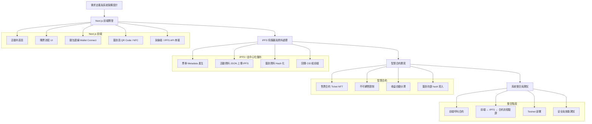

可以，下面我把 **去中心化售票與簽到系統** 整理成一個**可直接給 AI agent 使用的開發流程圖**，並且**順序嚴格符合你指定的：**

> **Next.js 前端 → IPFS 伺服器 → 智慧合約 → 最後整合**

我會先給你 **Mermaid 流程圖（最適合丟給 AI agent 直接理解與拆任務）**，再補一個 **文字版流程拆解（避免 AI 寫歪）**。

---

## 一、開發流程圖（Mermaid）

你可以直接貼給 AI agent：

---

## 二、給 AI agent 的「正確開發順序說明」（很重要）

這段**建議你一起貼給 AI agent**，避免它跳步或亂加後端。

### Phase 1：Next.js 前端（先假資料）

**目標：所有 UI 與流程先跑起來**

* 不接合約、不接 IPFS
* 使用 mock data / local state
* 功能：

  * 活動列表
  * 購票流程
  * 錢包連線（但不送交易）
  * 簽到頁（QR Code 掃描 UI）

👉 原因：
UI 與使用者流程錯了，後面全部白做

---

### Phase 2：IPFS 伺服器與資料處理

**目標：處理「不適合上鏈的資料」**

* 產生：

  * 活動 metadata（JSON）
  * 票券 metadata（NFT metadata）
* 將資料上傳 IPFS
* 回傳 CID 給前端
* **簽到資料只做 hash，不存個資**

👉 原因：
避免大量資料與 GDPR 問題直接進鏈

---

### Phase 3：智慧合約撰寫

**目標：只負責「信任與金流」**

* 功能最小化：

  * NFT 售票
  * 不可轉售（或限制轉移）
  * 收益分潤
  * 簽到 hash 上鏈（存證）
* 不處理 UI
* 不處理大量資料

👉 原因：
合約是最難改、最貴的部分

---

### Phase 4：整合與測試

**目標：讓整個去中心化流程真的跑起來**

* Next.js：

  * 呼叫 IPFS API
  * 呼叫智慧合約
* 驗證流程：

  1. 建立活動 → IPFS
  2. 售票 → 合約 mint NFT
  3. 簽到 → hash → 合約存證
* Testnet 部署
* 壓力測試 / gas 成本檢查