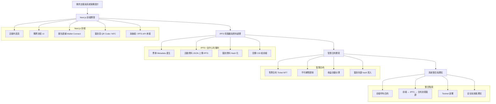

可以，下面我把 **去中心化售票與簽到系統** 整理成一個**可直接給 AI agent 使用的開發流程圖**，並且**順序嚴格符合你指定的：**

> **Next.js 前端 → IPFS 伺服器 → 智慧合約 → 最後整合**

我會先給你 **Mermaid 流程圖（最適合丟給 AI agent 直接理解與拆任務）**，再補一個 **文字版流程拆解（避免 AI 寫歪）**。

---

## 一、開發流程圖（Mermaid）

你可以直接貼給 AI agent：

---

## 二、給 AI agent 的「正確開發順序說明」（很重要）

這段**建議你一起貼給 AI agent**，避免它跳步或亂加後端。

### Phase 1：Next.js 前端（先假資料）

**目標：所有 UI 與流程先跑起來**

* 不接合約、不接 IPFS
* 使用 mock data / local state
* 功能：

  * 活動列表
  * 購票流程
  * 錢包連線（但不送交易）
  * 簽到頁（QR Code 掃描 UI）

👉 原因：
UI 與使用者流程錯了，後面全部白做

---

### Phase 2：IPFS 伺服器與資料處理

**目標：處理「不適合上鏈的資料」**

* 產生：

  * 活動 metadata（JSON）
  * 票券 metadata（NFT metadata）
* 將資料上傳 IPFS
* 回傳 CID 給前端
* **簽到資料只做 hash，不存個資**

👉 原因：
避免大量資料與 GDPR 問題直接進鏈

---

### Phase 3：智慧合約撰寫

**目標：只負責「信任與金流」**

* 功能最小化：

  * NFT 售票
  * 不可轉售（或限制轉移）
  * 收益分潤
  * 簽到 hash 上鏈（存證）
* 不處理 UI
* 不處理大量資料

👉 原因：
合約是最難改、最貴的部分

---

### Phase 4：整合與測試

**目標：讓整個去中心化流程真的跑起來**

* Next.js：

  * 呼叫 IPFS API
  * 呼叫智慧合約
* 驗證流程：

  1. 建立活動 → IPFS
  2. 售票 → 合約 mint NFT
  3. 簽到 → hash → 合約存證
* Testnet 部署
* 壓力測試 / gas 成本檢查

### 手工寫的
## 首頁
1. [X] 做出UI介面，透過hono從資料庫取得活動列表並顯示

## 主辦者
1. [X] 做出UI介面，可供任何人建立一個活動，填寫活動資訊並連接錢包
2. [X] 送出活動後，簽名的地址即為主辦方(活動上鏈後不可更改)
3. [X] 將活動完整資訊儲存到IPFS，IPFS回傳CID。將CID及活動摘要存入傳統資料庫(hono)
4. [X] 將CID、活動資訊的HASH、主辦者address、最大票數、每張票價格，透過 Ethereum Sepolia 智慧合約 上鏈，合約回傳該「活動識別碼(將CID、活動資訊的HASH及主辦者address作hash)」
 - 價格資訊應為美分，即要乘上100
5. [X] 回傳該活動的網頁 QR Code。QR Code內含活動識別碼、CID
6. [X] 合約也存 mapping 活動識別碼 → {主辦者 address, 每張票券的價格(美分), 最大票數, 目前已用}

## 參加者
1. [X] 做出一個UI介面，活動連結網頁中可顯示活動資訊(由CID向IPFS取得)
2. [X] 參加者連接錢包
3. [ ] 網頁透過CID、活動資料計算出活動識別碼，並可向智慧合約驗證活動是否存在
4. [ ] 參加者透過合約進行付款，將付款資訊(活動識別碼、票券ID(隨機產生的nonce)、買家地址)的hash上鏈成為「付款識別碼」，並返回一個獨特QR Code (付款識別碼 mapping 值為0)
5. [ ] 智慧合約在付款成功後馬上透過活動識別碼查詢主辦者address，並將付款金額的75%撥款給主辦者，25%撥款給合約建立錢包地址 (建議在合約裡做 交易失敗回滾 檢查，避免分帳失敗造成資金鎖住)

## 實體活動
1. [ ] 主辦方透過相機掃描QR Code以進行驗票
2. [ ] 開啟特定的UI介面網頁，該網頁透過QR Code附加的付款識別碼對鏈上資訊進行驗證(透過智慧合約)，合約驗證完後透過mapping將付款識別碼對應一個timestamp
3. [ ] 回傳成功(付款識別碼尚未被使用 mapping 為0)或失敗(付款識別碼已經有對應的timestamp)

## hash?
keccak256

## IPFS規劃
- 有一個端點可接受IPFS輸入
- 輸入資料為JSON格式字串
- 將JSON格式字串存入IPFS，並生成隨機的CID作為鍵值對應的key
- 有一個端點可以傳入CID並回應對應的JSON格式資料

## 智慧合約
請幫我撰寫智慧合約(Ethereum Sepolia)，主要內容如下:

### 函數A(建立活動)
- 傳入智慧合約的參數有: CID、HASH、主辦者address
- 合約會對所有參數再次進行HASH成為活動識別碼並回傳
- 合約本身要透過儲存空間儲存活動識別到=>{主辦者address、票券已使用量、票券最大供應量}的對應關係

### 函數B(購買票券)
- 傳入活動識別碼、票券ID(nonce)、買家address
- 合約將這些參數再次hash成為付款識別碼
- 合約要檢查已購買票券數量是否有超過活動的票券最大供應量，若票券售罄則直接拋出錯誤(購買失敗)
- 若票券還有剩下則可進行付款
- 扣除買家對應的票券購買量的測試幣
- 將測試幣數量的25%撥款給智慧合約建立者的地址、75%撥款給主辦者的地址
- 合約本身要透過儲存空間儲存付款識別到=>時間戳的對應關係(預設是0)
- 返回付款識別碼

### 函數C(驗票)
- 傳入付款識別碼
- 合約檢查儲存空間中付款識別到=>時間戳的對應關係，若時間戳為0代表還沒使用，則更新目前時間寫入儲存空間並返回驗票成功 true
- 如果時間戳數字大於0，表示票券已使用，合約回傳的結果應該要是 false

最後，需要用到 blockchain oracle，選擇的是chainlink，而chainlink在這裡主要提供查詢:
1. ETH主網路上的價格(用來計算票券價格轉換成ETH應該要是多少)
2. 目前的現實時間戳